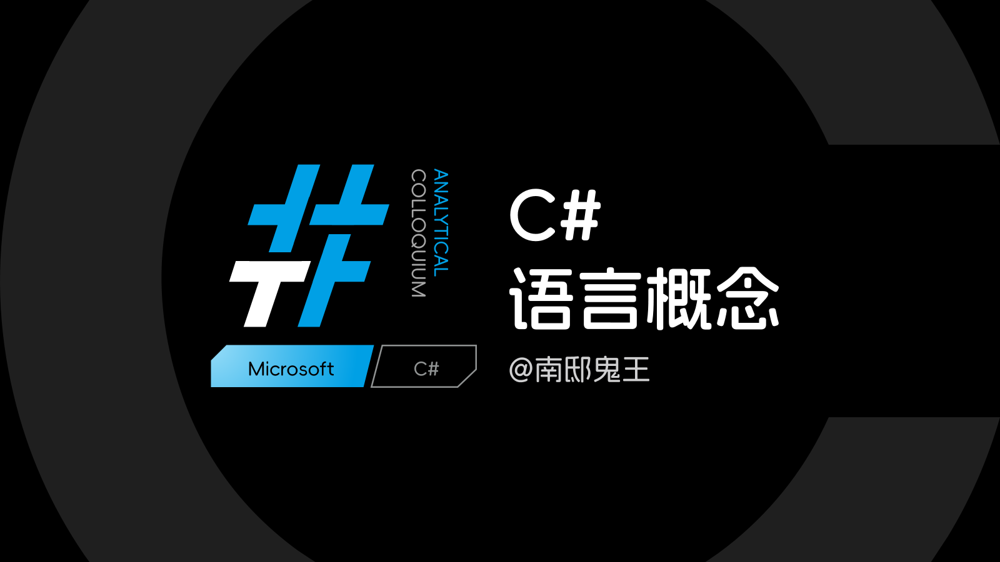
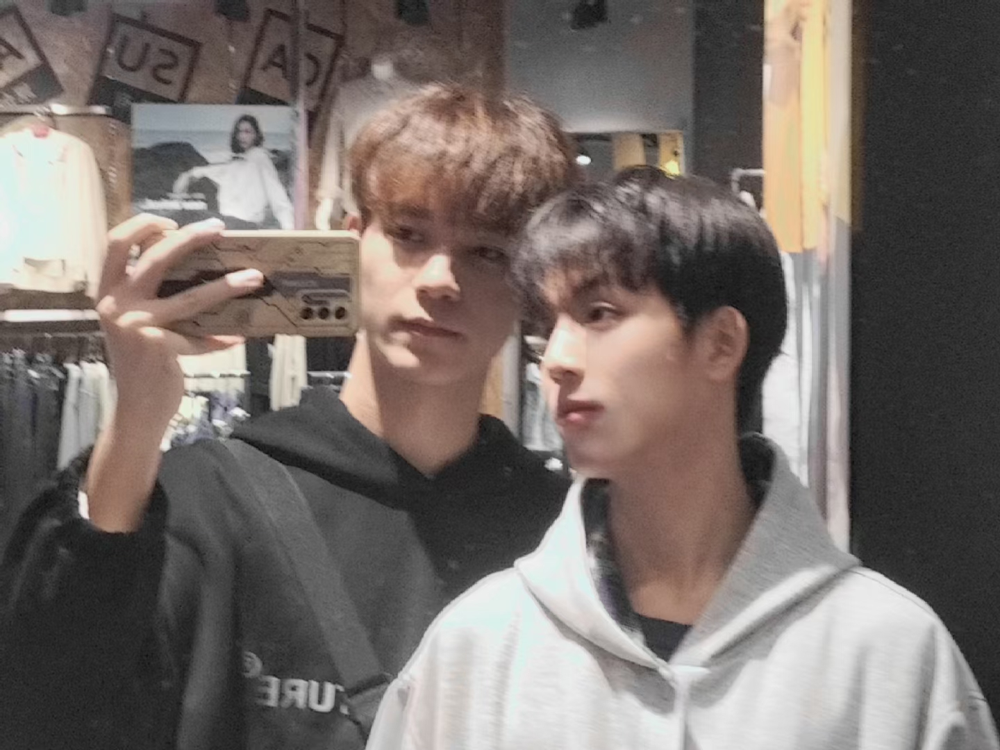

 

# Yohson KINGC README CN\_zh

你好，我是金煜城(金耀森)，很高兴认识你！

我有一个大家更为熟悉的称呼——“南邸鬼王”。准确的说，我是在2020年开始正式做.NET开发的，C#语言的优雅让我非常喜爱.NET技术开发。2023年10月我开启了视频站博主身份，以再述《深入浅出WPF》一书的形式发布了我的第一个系列教程，获得了广大开发者的喜爱和支持。现在我主要在进行C#语言和WPF技术的开发教研活动，致力于为中国社区做出更多开源开放技术教程。

   

## 我的系列教程

- **WPF故事模式(标准版)** 2023年10月 | 已完结
- **WPF故事模式(创元版)** 2025年10月 | 创作中
- **WPF窗口外观方案** 2025年01月 | 长期持续

 

- **散装解决方案** 2024年03月 | 长期持续
- **WPF用户控件互联项目** 2023年11月 | 已完结
- **C#语言概念(旧内容)** 2023年08月 | 已停更

 

## 关于我

准确来说，我并不是一名程序员。我的职场身份是一位平面视觉设计师，主要从事广告设计、视觉设计、UI设计等工作。我一直是一个多元创作者：

- 💻 C#/.NET技术开发者
- ✏ 平面视觉设计师
- 🎵 混音师
- 🎤 流行演唱、舞蹈

除此之外，还有各种零零散散的技术、艺术等兴趣爱好。保持这种多元和热爱，我认为是我人生中的最大价值。这里是我(左边)和我的伴侣(右边)。

   

## 联系方式

🐧 腾讯QQ | 1486001516

📫 E-mail | GhostKINGC\_22\@outlook.com

⚡ 开发者QQ群聊 | 718368213

